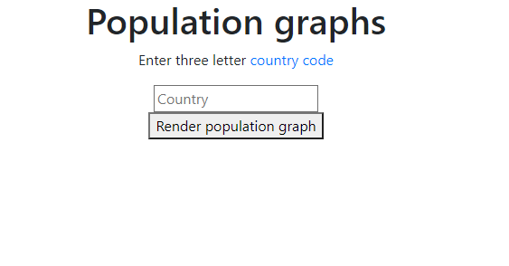
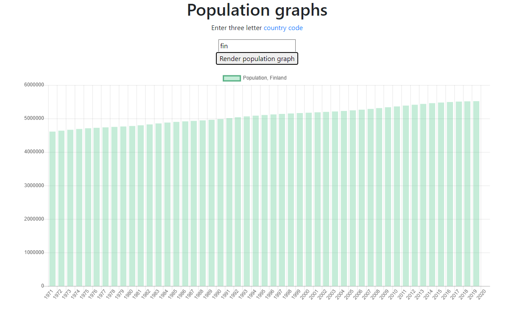

# Population Graphics
A web application to visualize population data. This application was made following a [MOOC by Sympa](https://sympaoy.github.io/webcodingforbeginners/ "Homepage of the MOOC") in the spring of 2020.
The app can visalize population time series for any country based on user input. Users can input a country code and the app utilizes the WORLd Bank API to fetch that country's data.

The country code input view

Population graph for Finland
